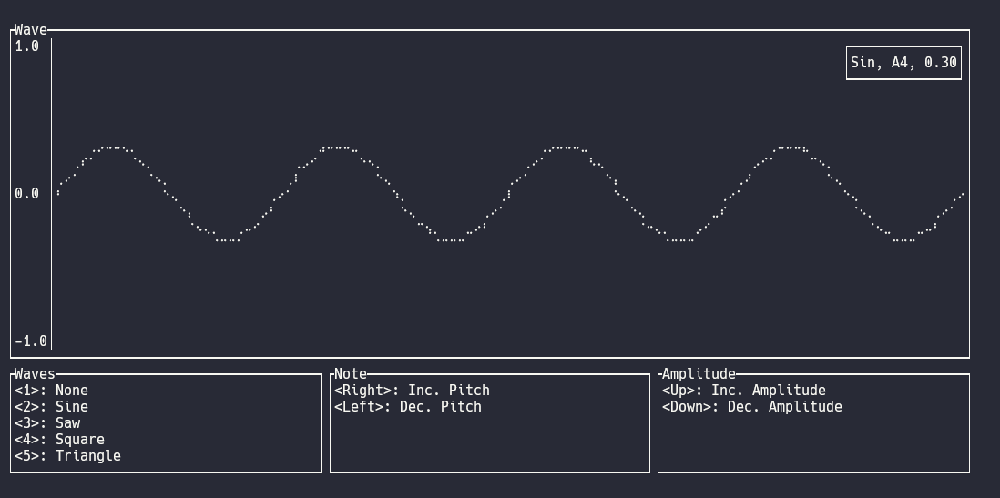

# Rust Synthesizer

This repo contains a small working example of using [cpal](https://github.com/RustAudio/cpal) to make a really basic synthesizer, as well as building a [TUI](https://en.wikipedia.org/wiki/Text-based_user_interface) using [ratatui](https://github.com/ratatui-org/ratatui) to display the waves being produced.

## Features

The synth allows the user to control the following parameters

- Waveform used
  - Sine wave
  - Saw wave
  - Square wave
  - Triangle wave
- Pitch
  - This can be any note from C0 to B8
  - Notes are tuned from C0 = 16.35160hz which is equivalent to A4 = 440hz
- Amplitude of the wave